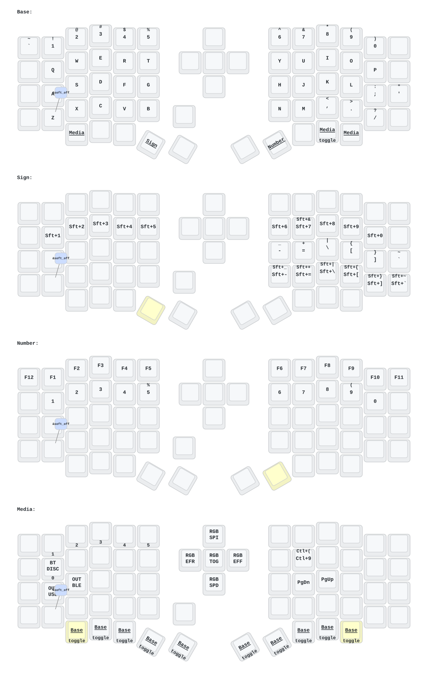

# zmk-sofle

Eyelash Sofle 的 ZMK 韌體設定（個人分支）。

上游（產品資訊與購買）：<https://github.com/a741725193/zmk-sofle>

## 鍵位圖



由 `.github/workflows/draw.yml` 使用 [keymap-drawer](https://github.com/caksoylar/keymap-drawer)
自動產生。每次 `config/` 有變動就會重畫並 commit 回本分支，不需手動更新。

## 日常會動到的只有 `config/`

| 檔案 | 用途 |
| --- | --- |
| `config/eyelash_sofle.keymap` | **按鍵配置**，目前 4 層 |
| `config/eyelash_sofle.conf` | 韌體設定：RGB、背光、debounce、soft-off |
| `config/eyelash_sofle.json` | 實體佈局，給 [keymap-editor](https://nickcoutsos.github.io/keymap-editor/) 用 |
| `config/west.yml` | ZMK 來源與版本（釘在 `zmkfirmware/zmk` v0.3.0） |

改完 push，GitHub Actions 會自動編譯，到 Actions 頁面下載 artifact 裡的 `.uf2`。左右手都要刷。

改 keymap 有三種方式：直接編 `.keymap`、用 [keymap-editor](https://nickcoutsos.github.io/keymap-editor/)（讀 `config/eyelash_sofle.json` 取得實體佈局）、或用 [ZMK Studio](https://zmk.studio/)（佈局是從韌體內的 `zmk,physical-layout` 讀的，不經過這個 repo）。

## BLE profile 的切換與斷線

都綁在 media layer 的左手側，與螢幕上那排圈圈對應：

| 位置 | binding | 作用 |
| --- | --- | --- |
| 第一排，左起第 2–6 格 | `&bt BT_SEL 0`–`4` | 切到第 n 個（0 起算）profile |
| 第二排，左起第 2–6 格 | `&bt BT_DISC 0`–`4` | 斷開第 n 個（0 起算）profile，**配對保留** |
| 第四排，左半最右格 | `&bt BT_CLR` | 解除**當前** profile 的配對（斷線 + 忘記這台主機） |

> **螢幕上的編號比 keymap 參數大 1。** 螢幕畫的是 `i + 1`，`&bt` 吃的是 0-based index。
> 螢幕顯示「2」的那個圈圈，要用 `&bt BT_DISC 1` 才斷得掉。鍵位圖上的數字已經換算成
> 螢幕的編號，照圖按即可。

三件按下去之前該知道的事：

- **`&bt BT_DISC n` 斷的是「第 n 個（0 起算）profile」，不是「目前這條連線」。** ZMK 沒有
  「斷開當前連線」這個指令；唯一作用在當前 profile 的是 `BT_CLR`，但它會把配對一起刪掉。
- **對未配對或當下未連線的 profile 按 `BT_DISC`，韌體回 `-ENODEV`，畫面不會有任何反應。**
  看起來像「斷不開」，其實是本來就沒連著。斷成功的話，該 profile 的圈圈會從實線整圈變成
  8 段虛線圈。
- **斷開後主機可能會馬上自己連回來**，macOS 尤其如此。這在 BLE 協定層面擋不住 —— 鍵盤
  只能斷開，不能阻止對方重新發起連線。要確實甩開得在主機上操作。

`&bt BT_CLR` 原本放在第二排 `BT_SEL 4` 的正下方，位置太好按，而那一格正是 `BT_DISC 4`
該在的地方。現已移到第四排左半最右，與 SEL / DISC 兩排隔著 endpoint 那排 —— 想斷線時
按錯而把配對清掉的機會小得多。

## 目錄結構

```
.
├── build.yaml                  建置目標：左手(studio) / 右手 / settings_reset
├── config/                     ★ 日常設定，見上表
├── boards/arm/eyelash_sofle/   自建 board 定義（self-contained，MCU 焊死在 PCB 上）
├── keymap-drawer/              keymap 圖，CI 自動產生，請勿手動編輯
├── keymap_drawer.config.yaml   keymap 圖的樣式與圖示對應
├── zephyr/module.yml           讓本 repo 能被當成 ZMK module（board_root）
├── .github/workflows/
│   ├── build.yml               編譯韌體，釘在 ZMK v0.3.0
│   └── draw.yml                產生 keymap 圖並 commit 回本分支
├── AGENTS.md                   AI agent 指引
├── docs/adr/                   架構決策紀錄
└── docs/agents/                agent skill 設定（issue tracker / triage / domain）
```

### `boards/arm/eyelash_sofle/`

這把鍵盤是 self-contained（nRF52840 直接焊在 PCB 上），所以在 ZMK 裡是 **board** 而不是 shield。

| 檔案 | 用途 |
| --- | --- |
| `eyelash_sofle.dtsi` | 共用硬體：矩陣掃描、編碼器、WS2812、PWM 背光、nice_view SPI |
| `eyelash_sofle-layouts.dtsi` | 實體佈局，64 顆鍵的座標（含拇指鍵旋轉），ZMK Studio 靠它繪圖 |
| `eyelash_sofle_left.dts` / `_right.dts` | 左右手各自的 board |
| `eyelash_sofle_left_defconfig` / `_right_defconfig` | 左右手的 Kconfig（左手為 split central） |
| `Kconfig.board` / `Kconfig.defconfig` | board 宣告與預設值 |
| `board.cmake` | 燒錄器設定 |
| `eyelash_sofle.keymap` | board 內建的預設 keymap，實際會被 `config/` 的蓋掉 |
| `eyelash_sofle.yaml` / `.zmk.yml` | Zephyr twister 與 ZMK 硬體 metadata |

## 與上游的關係

本分支停在**舊架構**（自建 board + ZMK 專案 v0.3.0）。上游已於 2026-06 改為
shield 架構並把 ZMK 來源改指 cormoran fork，本分支兩者都未跟進，決定與理由記在
[ADR 0001](docs/adr/0001-defer-shield-and-fork-migration.md)。

上游仍保留為 `upstream` remote 供對照：

```bash
git fetch upstream
git diff nimo upstream/main -- <path>          # 比對差異
git show upstream/main:<path>                  # 取回清理掉的檔案
```
